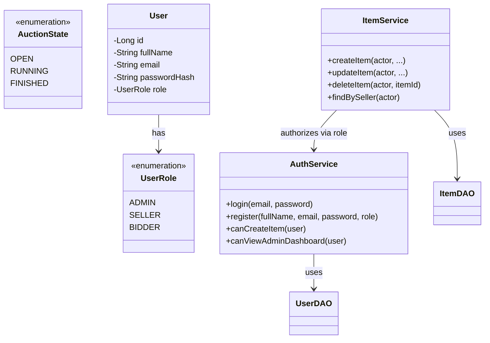

# UML Class Diagram

```mermaid
classDiagram
    class UserRole {
      <<enumeration>>
      ADMIN
      SELLER
      BIDDER
    }

    class AuctionState {
      <<enumeration>>
      OPEN
      RUNNING
      FINISHED
    }

    class User {
      -Long id
      -String fullName
      -String email
      -String passwordHash
      -UserRole role
    }

    class AuthService {
      +login(email, password)
      +register(fullName, email, password, role)
      +canCreateItem(user)
      +canViewAdminDashboard(user)
    }

    class ItemService {
      +createItem(actor, ...)
      +updateItem(actor, ...)
      +deleteItem(actor, itemId)
      +findBySeller(actor)
    }

    User --> UserRole : has
    AuthService --> UserDAO : uses
    ItemService --> ItemDAO : uses
    ItemService --> AuthService : authorizes via role
```

